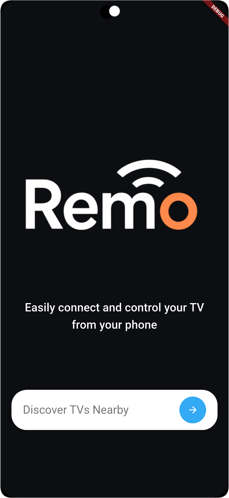
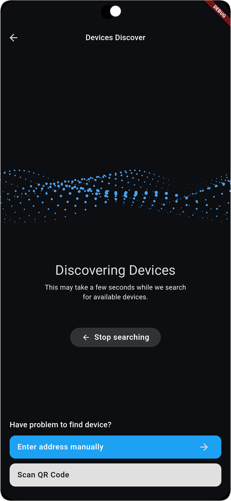
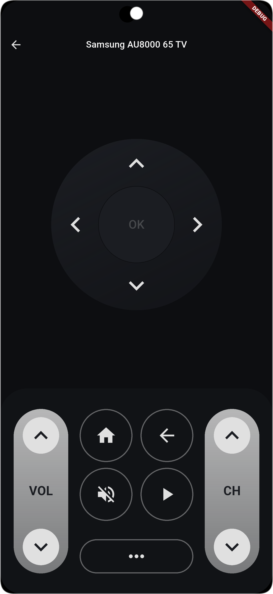

# Remo Remote Control

Remo Remote Control is a modular Flutter application designed to control a wide variety of smart TVs and devices from a single, unified interface. The project is built for extensibility, maintainability, and ease of integration with new device types.

---

## Features
- Modular architecture for easy extension and maintenance
- Adapter pattern for supporting multiple TV brands (e.g., Samsung, Mock)
- Device discovery and connection management
- Responsive and accessible UI
- Dependency injection for scalable state and service management
- Testable and well-documented codebase

---

## Tech Stack
- **Flutter** (UI framework)
- **Dart** (language)
- **Custom Dependency Injector (AppScope)** — demonstrates understanding of DI patterns
- **WebSocket** (for device communication)
- **Custom Adapter Pattern** (for device extensibility)

---

## About .ai-context (zenozaga/contextops)

This project uses the `.ai-context` folder structure inspired by [zenozaga/contextops](https://github.com/zenozaga/zeno-contextops). This approach provides structured, machine-readable context for AI agents and developers, including:

- **Rules** for code style, error handling, and project conventions
- **Goals** and step-by-step tasks for automation and onboarding
- **Knowledge base** for technical notes and protocol documentation
- **API references** and templates for scaffolding code and tests

### Advantages of Using .ai-context
- **Consistency:** Ensures all contributors and AI agents follow the same standards and patterns.
- **Productivity:** Reduces onboarding time and enables rapid, automated scaffolding and refactoring.
- **Documentation:** Centralizes project knowledge, making it easy to maintain and evolve.
- **AI-Ready:** Enables advanced code generation, refactoring, and documentation by providing clear, structured context.

For more details, see the `.ai-context/` folder in this repository.

---

## Demo / Screenshots
Below are screenshots of the app in action:

|  |  |  |
|-------------------------------------|-------------------------------------|-------------------------------------|
---

## Getting Started

### Prerequisites
- Flutter SDK (see [Flutter installation guide](https://docs.flutter.dev/get-started/install))
- Dart SDK (included with Flutter)

### Setup
1. Clone this repository.
2. Run `flutter pub get` to install dependencies.
3. Run `flutter run` to launch the app on your device or emulator.

### Testing
- Run `flutter test` to execute all unit and widget tests.

---

## Project Structure

```
lib/
	main.dart                  # App entry point
	application/
		di/                      # Dependency injection (AppScope)
		data/
			adapters/              # Device adapters (Samsung, Mock, etc.)
		modules/
			connect/               # Device discovery, connection, and adapter logic
		navigation/              # Route management
		ui/                      # UI components, screens, themes
```

### Dependency Injection: AppScope
- Located in `lib/application/di/app_scope.dart`.
- Centralizes the creation and management of app-wide dependencies (services, stores, etc.).
- Promotes testability and loose coupling between modules.

### Connect Module
- Located in `lib/application/modules/connect/`.
- Handles device discovery, connection logic, and state management.
- Uses the adapter pattern: each device/brand implements its own adapter (e.g., SamsungDeviceAdapter, MockDeviceAdapter).
- Adapters encapsulate communication protocols and expose a unified interface for the UI.

### Adapter Implementations
- Each TV/device brand has its own folder in `lib/application/data/adapters/`.
- Adapters extend `DeviceAdapter` and implement required capabilities (remote control, volume, etc.).
- New adapters can be added with minimal changes to the rest of the app.

### UI Layer
- Organized by feature (connect, device, home) and shared components/layouts.
- Follows Flutter best practices for responsive and accessible design.

---

## How to Add a New Device Adapter
1. Create a new folder in `lib/application/data/adapters/<brand>/`.
2. Implement a class extending `DeviceAdapter` and required methods.
3. Add capabilities using provided mixins and capability classes.
4. Update the connect module to recognize and use the new adapter.
5. Add or update UI screens as needed.
6. Document the adapter in `.ai-context/`.

---

## Development & Testing
- All business logic is testable and adapters can be tested in isolation (see `test/`).
- Use the MockAdapter for integration and UI tests without real devices.
- See `.ai-context/` for project rules, goals, and technical documentation.

---

## Roadmap
- [x] Modularize connect and adapter logic
- [x] Implement Samsung TV adapter
- [x] Responsive UI for device control
- [ ] Device Store for managing connected devices
- [ ] Add more adapters (LG, Sony, etc.)
- [ ] Improve test coverage and add integration tests
- [ ] Enhance documentation and developer onboarding

---

## Contributing
- The project is designed for clarity, extensibility, and real-world maintainability.
- Follows modern Flutter/Dart best practices.
- Open to contributions and feedback.

For more information about the .ai-context standard and its benefits, see the official documentation: [zenozaga/contextops](https://github.com/zenozaga/zeno-contextops)

